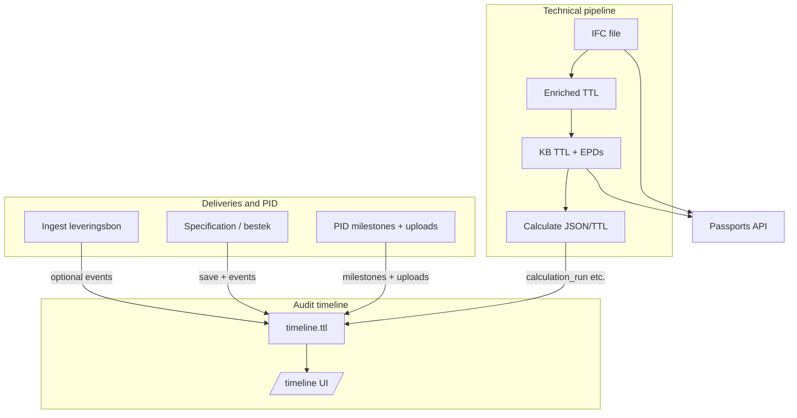

# Data flow: BIM, materials, timeline, PID, and deliveries

**Purpose:** One diagram-heavy reference for how **IFC**, **material slugs / EPDs**, **element ids**, and **audit events** connect — and where **PID** and **deliverables** sit relative to the technical pipeline.

For artifact file names and phases 1–3 UI labels, see [`docs/bim-to-kg-journey.md`](bim-to-kg-journey.md). For the three conceptual “lanes” (pipeline vs audit vs reference lifecycle), see [`docs/roadmap-milestones.md`](roadmap-milestones.md) and [`docs/timeline-first-and-document-matching.md`](timeline-first-and-document-matching.md).

---

## 1. Technical pipeline (BIM → knowledge graph → calculate)

```text
IFC (data/<projectId>.ifc)
       │
       ▼
Phase 1 — parse & enrich
       │  data/<projectId>.ttl
       │  data/<projectId>-enriched.ttl
       │  Elements: quantities, layer names, IFC types
       ▼
Phase 2 — link (dictionary + sources)
       │  data/<projectId>-kb.ttl   ← primary graph for passports & calculate
       │  Materials ↔ bim:epd-* (slug, GWP, unit, provenance)
       ▼
Phase 3 — calculate
       │  data/<projectId>-calc.ttl
       │  data/<projectId>-calc-latest.json
       ▼
Compliance / pilot UI reads KB + IFC-derived fields (e.g. fire rating) where wired
```

**Material trace (carbon-relevant):**

1. **IFC** exposes **material names** (often localized, layered).
2. **`material-dictionary.json`** maps names to **routing slugs** (not invented LCA numbers).
3. **Source TTL** (KBOB, ICE, B-EPD, …) **hydrates** `bim:epd-*` nodes when scores and config allow.
4. **`GET /api/kb/status`** builds **element passports**: per **express id**, list of materials with **`epdSlug`**, **`lcaReady`**, quantities, etc. (`src/lib/phase4-passports.ts`).

---

## 2. Identifiers (what “BIM id” means here)

| Id | Role |
|----|------|
| **Express id** | Numeric **viewer / API** handle (ThatOpen, selection, `?expressId=` on `/bim`). |
| **globalId** | IFC **GloballyUniqueId** — stable in exchanges when preserved. |
| **`bim:element-*`** | **RDF subject** in project TTL for the knowledge graph. |
| **`material_slug` / `epdSlug`** | **Semantic** material key shared across **bestek**, **KB**, and **calculate** (dictionary + overrides). |

Timeline events can carry **`targetExpressId`** (and related fields) to anchor **evidence** to an element without duplicating the whole graph.

---

## 3. Audit timeline (append-only)

**Store:** `data/<projectId>-timeline.ttl`  
**Sort key:** `timeline:timestamp` on each `timeline:AuditEvent`  
**Vocabulary:** `timeline:eventAction` literals from `src/lib/timeline-events-vocab.ts`

**Pipeline milestones** (examples): `model_imported`, `parse_enrich_completed`, `kb_built`, `calculation_run`.

**Deliveries / site / evidence** (examples): `delivery_document_added`, `site_report_added`, `document_reference_logged`, `document_original_stored`, `bestek_bindings_milestone`, `product_coupling_updated`, `epcis_supply_chain_event`.

**PID reference lifecycle:** `pid_reference_milestone` **+** `timeline:pidMilestoneKey` (+ optional `timeline:pidLifecyclePhase`, `timeline:pidStateHint`). Template seed events are labeled in UI as **template** vs real business dates (`src/lib/timeline-lifecycle-overview.ts` tests cover this).

**Rule:** Saving **bindings JSON** or **deliveries Turtle** under `data/` does **not** by itself create a timeline row; the **ingest or API path** must append the matching **`AuditEvent`** (`docs/timeline-first-and-document-matching.md`).

---

## 4. Deliveries UI: three tabs, one `projectId`

Canonical query params are normalized in `src/lib/deliveries-tabs.ts` (tests: `npm run test:deliveries-tabs`).

| Tab | Role | Typical artifacts / events |
|-----|------|-----------------------------|
| **ingest** | Leveringsbon JSON → match → optional `*-deliveries.ttl` + `delivery_document_added` | `POST /api/deliveries/ingest` |
| **specification** | IFC-type groups, bestek bindings, contractor coupling, opmeting fiche | `bestek_bindings_milestone`, `bestek_element_group_binding`, … |
| **pid** | PID milestone registration, template seed, document uploads | `pid_reference_milestone`, `document_original_stored`, … |

**PID tab macro bands (UI):** design & spec **0–1** · site & core dossier **2–3** · handover & aftercare **4–9** — see [`docs/deliveries-pid-tab-subdivisions.md`](deliveries-pid-tab-subdivisions.md). This is **presentation** grouping; **time order** remains the timeline file.

---

## 5. How PID / deliverables relate to BIM materials

- **Bestek** binds **IFC-type groups** (and partitions, e.g. coverings) to **material slugs** and article metadata → timeline can record **`timeline:bestekMaterialSlug`** on binding-related events.
- **Passports / calculate** use the **same slug space** via the KB (`epdSlug`).
- **Leveringsbon** lines today are **evidence** and dictionary matches in **deliveries RDF**; **automated** line → **element** linking is roadmap **M-Delivery-Element-Link** (`docs/roadmap-milestones.md`).
- **Werfverslag / site reports** map to `site_report_added` with optional element/material references via `POST /api/timeline`.

So: **materials are traceable end-to-end inside the BIM+KB world**; **site/delivery documents** are traceable in **time and provenance** on the timeline, with **element-level** delivery automation still **explicitly** future work.

---

## 6. Quick mental model (single diagram)



---

## Related docs

- [`docs/system-wide-checkup-2026-04-07.md`](system-wide-checkup-2026-04-07.md) — checkup summary, tests, lint note.  
- [`docs/pid-digitization-plan.md`](pid-digitization-plan.md) — product tiers and gaps.  
- [`docs/workflow-readiness.md`](workflow-readiness.md) — dashboard checklist vs three lanes.

---

## Revision history

- **2026-04-07:** Initial data-flow reference for BIM, materials, timeline, PID, and deliveries.
