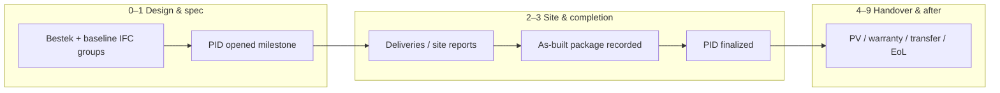

# Deliveries · PID tab — phase subdivisions & data flow

The **PID** tab (`/deliveries?tab=pid`) shows the **Postinterventiedossier (PID)** as a **timeline-first** strip: each allowlisted `pid_reference_milestone` is a **chapter card**, grouped into **three macro bands** that match how teams talk about the process (design → execution & dossier → handover & aftercare). Canonical mapping of milestone → Belgian reference phase **0–9** lives in `src/lib/timeline-reference-phase.ts` (`PID_MILESTONE_REFERENCE_PHASE`). Narrative detail: `docs/pid-lifecycle-timeline-events.md`, product context: `docs/pid-digitization-plan.md`.

## 1. Three macro bands (UI)

| Band | Reference phases | Role |
|------|------------------|------|
| **Design & specification** | 0–1 | Freeze **bestek / specification** intent; open the **PID process** as an audit container. |
| **Site, completion & core dossier** | 2–3 | **Execution** evidence (deliveries, site reports) feeds **as-built** and **PID finalized** as the regulated completion package. |
| **Opleveringen, warranty & aftercare** | 4–9 | **Provisional / final handover**, **warranty**, **retrofit**, **transfer**, **end of life**. |

**Note:** Today no allowlisted milestone maps **only** to reference phase **2** (“Site / delivery”). Site-era reality still appears via **leading indicators** on milestone cards (e.g. `delivery_document_added`, `site_report_added`) and the **document bridge** list in the same panel. A future milestone key could be added if you want an explicit “site phase opened” PID row.

## 2. What data belongs in which phase (concise)

- **0 — Design / spec**  
  Structured **bestek** bindings, naming, IFC-type groups; baseline for “what was specified”. Feeds material/passport and compliance views downstream.

- **1 — PID opened**  
  Process anchor: PID is **opened** as the living dossier (dates, responsible actor, template vs real business dates). Not a substitute for legal signing—it's the **audit spine**.

- **2 — Site / delivery**  
  **Transactional** evidence: leveringsbonnen, werfverslagen, deliveries ingested from **Ingest · werf**. These are the **inputs** that justify what was actually installed before as-built consolidation.

- **3 — Completion / as-built**  
  **As-built package recorded** → **PID finalized**: consolidated “what is in the building” + regulatory completion narrative. This is the **core regulated output** of the construction PID story.

- **4–9**  
  **Handover** (provisional/final PV), **warranty** events, **modifications**, **property transfer**, **demolition / end of life** — long-horizon lifecycle; same PID timeline, different actors and documents.

## 3. Documents with which actors (typical pattern)

Actors are **labels on timeline events** (`actorLabel` / `actorSystem`); exact RACI is project-specific. A useful default mental model:

| Actor cluster | Typical artefacts | Where it shows up |
|---------------|-------------------|-------------------|
| **Architect / EPB / designer** | Bestek, specs, EPB-relevant declarations | Phase 0–1; evidence links on timeline |
| **Contractor / site** | Leveringsbon, werfverslag, execution photos | Phase 2; `delivery_document_added`, `site_report_added` |
| **Builder / PM / coordinator** | As-built compilation, dossier checks | Phase 3 milestones; PID finalized |
| **Client / FM / notary (later)** | PV documents, warranty lists, deed/transfer | Phases 4–9 milestones |

The app does **not** store PDFs in-repo by default: it records **events** and pointers; files live in your DMS or ingest pipeline.

## 4. Data flow between the three macro phases

- **Downstream:** Specification and opened PID set **expectations**; site evidence **grounds** the as-built; **finalized PID** is the package you defend at handover and beyond.  
- **Upstream (feedback):** Warranty and retrofit events can trigger **new** site reports or document adds—append-only timeline preserves the story.

## 5. Implementation

- **UI:** `src/components/DeliveriesPidPanel.tsx` — horizontal **chapter cards** grouped under the three bands above.  
- **Chapters:** `buildPidDossierChapters` in `src/lib/pid-dossier-from-timeline.ts` (canonical milestone order).  
- **Seeding:** Template seed events (`pid-template-seed`) use placeholder dates until replaced by real business dates.
