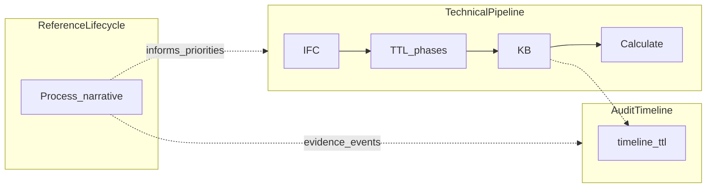

# Roadmap and milestones

**Single entry point** for what is shipped, what is next, and named milestones. This file is a **snapshot**, not a changelog: refresh it monthly or per release. For day-by-day detail use [`docs/BASE.md`](BASE.md); for PID strategy and tiers use [`docs/pid-digitization-plan.md`](pid-digitization-plan.md).

**Last reviewed:** 2026-04-07

---

## Shipped (product)

High-level themes with pointers to deeper docs.

| Theme | What exists | Deep dive |
|--------|-------------|-----------|
| **BIM → graph → carbon** | IFC parse/enrich, KB build, calculate, calc TTL/JSON; element passports via `GET /api/kb/status` | [`docs/bim-to-kg-journey.md`](bim-to-kg-journey.md) |
| **Sources & matching** | `material-dictionary.json` (routing), KBOB/ICE/B-EPD/epd-hub snapshots, `config.json`, `/sources`, `/kb` overrides | [`docs/sources-contract.md`](sources-contract.md), [`docs/kg-expansion-sources-benelux-eu.md`](kg-expansion-sources-benelux-eu.md) |
| **Compliance pilot** | `ifcFireRating` on passports, `src/lib/compliance-pilot.ts`, **Compliance (pilot)** on `/calculate`; optional compliance-run append to `*-compliance-events.ttl` | [`docs/compliance-data-checklist.md`](compliance-data-checklist.md), [`docs/compliance-run-ttl.md`](compliance-run-ttl.md) |
| **Audit timeline** | `data/<projectId>-timeline.ttl`, `/timeline`, `GET/POST /api/timeline`; **`pid_reference_milestone`** + PID filters; EPCIS ingest; deliveries ingest → timeline + deliveries TTL; MS Project XML + BCF imports | [`docs/timeline-first-and-document-matching.md`](timeline-first-and-document-matching.md), [`docs/timeline-schedule-integration.md`](timeline-schedule-integration.md), [`docs/timeline-event-taxonomy.md`](timeline-event-taxonomy.md), [`docs/timeline-epcis-integration.md`](timeline-epcis-integration.md), [`docs/deliveries-importer-integration.md`](deliveries-importer-integration.md), [`docs/pid-lifecycle-timeline-events.md`](pid-lifecycle-timeline-events.md) |
| **Bestek / deliveries UI** | Deliveries: **`?tab=ingest` \| `specification` \| `pid`** (legacy `tab=bestek` etc.); IFC-type groups, bindings, material matching, autofill, article unit/qty, NL label translations, timeline fields on binding events | [`docs/deliveries-importer-integration.md`](deliveries-importer-integration.md) §tabs; [`docs/bestek-material-template-nl.md`](bestek-material-template-nl.md); [`docs/unified-construction-lifecycle-tabulas.md`](unified-construction-lifecycle-tabulas.md) |
| **3D & BIM UI** | `/bim`: Building (ThatOpen), Passports (abstract 3D), Inspect; internal viewer opacity/highlight specs | [`docs/PRD-browser-3d-ifc-and-vr.md`](PRD-browser-3d-ifc-and-vr.md), [`docs/building-ifc-viewer-opacity-highlighting.md`](building-ifc-viewer-opacity-highlighting.md) |
| **Ops & workflow** | `GET /api/pipeline/trace`, `GET /api/workflow/readiness`, main nav **Dashboard** → `/workflow?step=dashboard` (readiness + sidecar), `/pipeline`, clean/reset | [`docs/reset-and-clean.md`](reset-and-clean.md), [`docs/workflow-readiness.md`](workflow-readiness.md) |

Also see the capability table in [`docs/pid-digitization-plan.md`](pid-digitization-plan.md) (“What `bimimport` already provides”).

---

## Near-term (roughly next 1–3 months)

Aligned with PID [Phase A follow-through and Phase B](pid-digitization-plan.md#engineering-roadmap-recommended) in [`docs/pid-digitization-plan.md`](pid-digitization-plan.md).

| Focus | Intent |
|--------|--------|
| **B-EPD fire / reaction** | Inventory machine-usable literals vs free text; map toward normalized enums where feasible (gap in PID plan). |
| **Executable rules** | Grow beyond the pilot: small JSON/YAML rule set + unit tests; no full Basisnormen PDF automation. |
| **Leveringsbon → element** | Linking model from delivery lines to `bim:element-*` / `globalId` / labels; surface in UI; project-specific naming (e.g. Schependomlaan). |
| **Engineering hygiene** | Parity `projectId` validation on APIs that write under `data/`; shared RDF helpers; run `tsc --noEmit` in CI where practical. |

Details: [`docs/codebase-health-2026-03-24.md`](codebase-health-2026-03-24.md), [`docs/schependomlaan-stakeholders-material-flow-brief.md`](schependomlaan-stakeholders-material-flow-brief.md) (honest gaps).

---

## Later / not committed

From [`docs/pid-digitization-plan.md`](pid-digitization-plan.md) (“What we are not committing to” and Phase D):

- JSON-LD/PDF export and **attest / signature** workflow (legal/product gate).
- **Comunica** / federated SPARQL as mandatory stack (evaluate only if needed).
- **Tier 3 — Circular / EoL** (BOM, recyclability, dismantling) as ontology-heavy follow-on.
- Full **KB Basisnormen** automation from PDF.

**Aligned with unified lifecycle** ([`docs/unified-construction-lifecycle-tabulas.md`](unified-construction-lifecycle-tabulas.md)) — product backlog language, not all committed:

- **Phase 3–4:** Full graph export at as-built; PV defect registry cross-check vs material data.
- **Phase 7–8:** Modification tracking over building life; notary / VIP-style digital handover pilots.
- **Phase 9:** Demolition inventory feeds circular economy platforms (e.g. TOTEM, B-EPD); EU DPP timelines 2027–2028 as external driver.

---

## Named milestones

| ID | Outcome | Owning context |
|----|---------|----------------|
| **M-Compliance-Depth** | Fire/reaction signals from B-EPD + richer rules beyond pilot; clear limitations in UI | [`docs/pid-digitization-plan.md`](pid-digitization-plan.md) Phase A, [`docs/compliance-data-checklist.md`](compliance-data-checklist.md) |
| **M-Delivery-Element-Link** | Delivery facts queryable per element; evidence chain visible | [`docs/pid-digitization-plan.md`](pid-digitization-plan.md) Phase B, [`docs/deliveries-importer-integration.md`](deliveries-importer-integration.md) |
| **M-Site-Evidence** | Werkverslag / installation confirmations as structured events (aspirational; not first-class yet) | Stakeholder lifecycle narrative when documented; [`docs/schependomlaan-stakeholders-material-flow-brief.md`](schependomlaan-stakeholders-material-flow-brief.md) |
| **M-Export-Attest** | Export pack + hooks for formal sign-off | [`docs/pid-digitization-plan.md`](pid-digitization-plan.md) Phase D |
| **M-3D-Compliance-Heatmap** | Building viewer tied to passport/compliance selection (Passports view is the current fast path) | [`docs/pid-digitization-plan.md`](pid-digitization-plan.md) gaps |
| **M-Engineering-Hardening** | Safer `projectId`, less duplicated RDF code, stronger CI | [`docs/codebase-health-2026-03-24.md`](codebase-health-2026-03-24.md) |

---

## Three lanes: do not conflate them

The app mixes **technical pipeline**, **append-only audit timeline**, and (optionally) a **reference construction lifecycle** narrative for stakeholders. They answer different questions.

- **Technical pipeline:** [`docs/bim-to-kg-journey.md`](bim-to-kg-journey.md), `/pipeline`, `/workflow`.
- **Audit timeline:** `*-timeline.ttl`, `/timeline` — **sort order is always `timeline:timestamp`**; leveringsbon and werfverslag placement: [`docs/timeline-first-and-document-matching.md`](timeline-first-and-document-matching.md).
- **Reference lifecycle:** stakeholder/process docs — canonical summary [`docs/unified-construction-lifecycle-tabulas.md`](unified-construction-lifecycle-tabulas.md); not the same as MS Project tasks or the RDF event log.

The **Dashboard** readiness table uses more row groups (`technical`, `audit`, `bestek`, …); see [`docs/workflow-readiness.md`](workflow-readiness.md) for how those map to the three lanes above.

---

## Open questions

See **Open questions (for Jacky / data / legal)** in [`docs/pid-digitization-plan.md`](pid-digitization-plan.md). Track answers there or in PRs; do not duplicate the full list here.

---

## Related docs

| Doc | Role |
|-----|------|
| [`docs/BASE.md`](BASE.md) | Chronological notes log |
| [`docs/pid-digitization-plan.md`](pid-digitization-plan.md) | PID vision, tiers, phased engineering roadmap |
| [`docs/bim-to-kg-journey.md`](bim-to-kg-journey.md) | Artifact flow Phase 1–3 |
| [`docs/schependomlaan-stakeholders-material-flow-brief.md`](schependomlaan-stakeholders-material-flow-brief.md) | Dataset, actors, honest material-flow gaps |
| [`docs/timeline-first-and-document-matching.md`](docs/timeline-first-and-document-matching.md) | Timeline sort key; leveringsbon / werfverslag → `eventAction` |
| [`docs/unified-construction-lifecycle-tabulas.md`](unified-construction-lifecycle-tabulas.md) | Stakeholder lifecycle Phase 0–9 + Tabulas capture (unified) |
| [`docs/pid-lifecycle-timeline-events.md`](docs/pid-lifecycle-timeline-events.md) | PID reference lifecycle → timeline `eventAction` / milestone keys |
| [`docs/PRD-SUMMARY.md`](PRD-SUMMARY.md) | Older PRD snapshot; may diverge from current UI |
