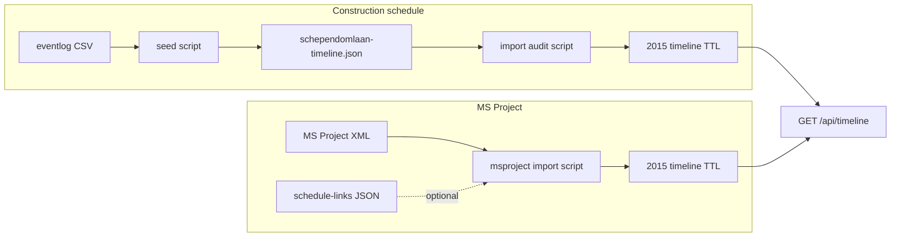

# Timeline source provenance

This document explains **which repo files back** `timeline:source` values (for example `construction-schedule`, `ms-project-xml`). The `source` string on an audit event is a **vocabulary label**, not a filesystem path. The UI links the real inputs on [/timeline/provenance](/timeline/provenance) and in expanded event metadata when we know the mapping.

Canonical mapping logic lives in `src/lib/timeline-source-provenance.ts` (keep this doc aligned when adding pipelines).

## Construction schedule (Schependomlaan 2015)

**When:** `projectId === "schependomlaan-2015"` and `timeline:source` is `construction-schedule`.

| Step | Role |
|------|------|
| `public/data/eventlog_IFC_schependomlaan.csv` | Raw task log: **Material**, task text, IFC GUIDs per row (served at `/data/eventlog_IFC_schependomlaan.csv`). |
| `scripts/seed-timeline-schependomlaan.ts` | Reads CSV, groups by task, emits JSON rows with `dpp:material/…` and `bim:element/IFC_{globalId}`. |
| `data/schependomlaan-timeline.json` | Generated intermediate (all `evt-schependomlaan-*` events). |
| `scripts/import-schependomlaan-timeline-audit.ts` | Imports JSON into the project timeline Turtle. |
| `data/schependomlaan-2015-timeline.ttl` | Served timeline graph; consumed by `GET /api/timeline`. |

**Materials:** Compare the CSV **Material** column to `materialReference` on events (and to passport/KB resolution in the app). The seeder maps CSV material strings onto `dpp:material/…` literals in RDF.

**Re-run (high level):** adjust CSV or seeder, regenerate JSON, run the import script, then reload the timeline in the app. Exact commands depend on your Node/tsx setup; see script headers and `package.json` scripts if present.

## MS Project XML (Schependomlaan 2015)

**When:** `timeline:source` is `ms-project-xml` and the project is Schependomlaan (importer and paths are project-specific today).

| Step | Role |
|------|------|
| `scripts/import-schependomlaan-msproject-timeline.ts` | Parses MS Project XML into timeline audit events. |
| `docs/DataSetArch/Planning/XML/Uitvoering Schependomlaan 18-02-2015.xml` | Default XML input path (see script / docs). |
| `data/schependomlaan-2015-schedule-links.json` | Optional sidecar: task UID → `expressId` / `materialReference` for richer links. |
| `data/schependomlaan-2015-timeline.ttl` | Append target for imported tasks. |

## Related contracts

- [`docs/sources-contract.md`](sources-contract.md) — how sources and locales are named elsewhere in the project.

## Data flow (sketch)

